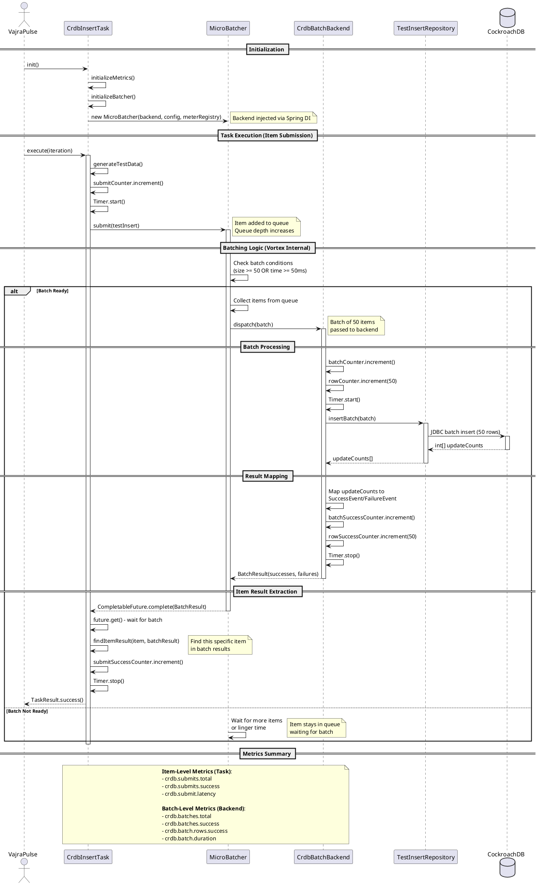

# Batching Architecture Design Explanation

## Overview

The batching architecture uses a **separation of concerns** pattern where:
- **CrdbInsertTask**: VajraPulse task that orchestrates individual item submissions
- **MicroBatcher**: Vortex library that batches items and manages queue
- **CrdbBatchBackend**: Implements batch processing logic for database operations

## Why CrdbInsertTask Depends on Backend

The dependency structure exists because:

1. **Vortex MicroBatcher Requires a Backend**: The `MicroBatcher` constructor requires a `Backend<T>` implementation to process batches
2. **Separation of Concerns**: 
   - **Task** = Orchestration layer (VajraPulse integration, metrics, item submission)
   - **Backend** = Processing layer (batch database operations, batch-level metrics)
3. **Dependency Injection**: Spring injects `CrdbBatchBackend` into `CrdbInsertTask`, which then passes it to `MicroBatcher`

## Architecture Flow

```
VajraPulse → CrdbInsertTask → MicroBatcher → CrdbBatchBackend → Database
   (orchestration)    (item submit)    (batching)      (batch process)
```

## Design Rationale

### 1. **Separation of Concerns**

**CrdbInsertTask Responsibilities:**
- Implements VajraPulse `TaskLifecycle` interface
- Generates test data for each execution
- Submits individual items to MicroBatcher
- Tracks **item-level** metrics (submits, submit latency)
- Waits for batch completion and extracts item result
- Returns TaskResult to VajraPulse

**CrdbBatchBackend Responsibilities:**
- Implements Vortex `Backend<T>` interface
- Processes **batches** of items
- Performs JDBC batch insert operations
- Tracks **batch-level** metrics (batches, rows, batch duration)
- Handles batch success/failure and maps to item results

### 2. **Why This Design?**

**Benefits:**
- **Reusability**: Backend can be used by other tasks/components
- **Testability**: Backend can be tested independently
- **Single Responsibility**: Each class has one clear purpose
- **Library Integration**: Follows Vortex library's expected pattern

**Alternative (Not Used):**
- Task could directly do batch inserts
- **Problem**: Mixes orchestration with batch processing logic
- **Problem**: Harder to test and maintain
- **Problem**: Doesn't follow Vortex library pattern

## Sequence Diagram



## Detailed Component Responsibilities

### CrdbInsertTask (Task Layer)

**Purpose**: VajraPulse task that submits individual items for batching

**Responsibilities**:
1. **Task Lifecycle**: Implements `TaskLifecycle` (init, execute, teardown)
2. **Item Generation**: Creates `TestInsert` records with random data
3. **Item Submission**: Submits items to `MicroBatcher` via `batcher.submit()`
4. **Result Extraction**: Waits for batch completion and finds specific item result
5. **Item Metrics**: Tracks submit-level metrics (total, success, failure, latency)

**Why it needs Backend**:
- `MicroBatcher` constructor requires `Backend<T>` parameter
- Backend is injected via Spring and passed to MicroBatcher
- Task doesn't directly use Backend - it's a dependency of MicroBatcher

### CrdbBatchBackend (Processing Layer)

**Purpose**: Processes batches of items and performs database operations

**Responsibilities**:
1. **Batch Processing**: Implements `Backend<T>.dispatch(List<T> batch)`
2. **Database Operations**: Calls `repository.insertBatch()` for JDBC batch insert
3. **Result Mapping**: Maps JDBC update counts to `SuccessEvent`/`FailureEvent`
4. **Batch Metrics**: Tracks batch-level metrics (batches, rows, duration)
5. **Error Handling**: Handles batch failures and maps to item-level failures

**Why it's separate**:
- Follows Vortex library's `Backend<T>` interface pattern
- Can be reused by other components
- Separates batch processing logic from task orchestration
- Easier to test and maintain

### MicroBatcher (Batching Library)

**Purpose**: Vortex library that manages batching logic

**Responsibilities**:
1. **Queue Management**: Maintains queue of submitted items
2. **Batch Formation**: Forms batches based on size (50) or time (50ms)
3. **Backend Invocation**: Calls `Backend.dispatch()` when batch is ready
4. **Result Distribution**: Distributes batch results back to waiting items
5. **Library Metrics**: Exposes Vortex metrics (queue depth, wait time, etc.)

## Dependency Flow

```
Spring Container
    ↓
CrdbBatchBackend (implements Backend<TestInsert>)
    ↓ (injected via constructor)
CrdbInsertTask
    ↓ (passed to constructor)
MicroBatcher<TestInsert>
    ↓ (calls when batch ready)
CrdbBatchBackend.dispatch(batch)
```

## Key Design Decisions

### 1. Why Task Depends on Backend?

**Answer**: It's actually an **indirect dependency**:
- Task receives Backend via Spring DI
- Task passes Backend to MicroBatcher constructor
- MicroBatcher uses Backend to process batches
- Task never directly calls Backend methods

**This is the Vortex library pattern** - MicroBatcher needs a Backend implementation.

### 2. Why Not Have Task Directly Do Batch Inserts?

**Problems**:
- Mixes orchestration (VajraPulse) with processing (batching)
- Harder to test batch logic independently
- Doesn't follow Vortex library's expected pattern
- Less reusable

**Benefits of Current Design**:
- Clear separation: Task = orchestration, Backend = processing
- Backend can be tested independently
- Follows library patterns
- More maintainable

### 3. Why Two Sets of Metrics?

**Item-Level Metrics (Task)**:
- Track individual item submissions
- Answer: "How many items were submitted?"
- Answer: "What's the latency from submit to completion?"

**Batch-Level Metrics (Backend)**:
- Track batch processing
- Answer: "How many batches were processed?"
- Answer: "What's the batch processing latency?"
- Answer: "How many rows were inserted?"

**Why Both?**
- Different perspectives: item view vs batch view
- Item metrics = user/application perspective
- Batch metrics = system/database perspective

## Alternative Designs (Not Used)

### Alternative 1: Task Directly Does Batching
```java
// NOT USED - mixes concerns
public class CrdbInsertTask {
    private List<TestInsert> batch = new ArrayList<>();
    
    public TaskResult execute() {
        batch.add(generateData());
        if (batch.size() >= 50) {
            repository.insertBatch(batch); // Direct call
            batch.clear();
        }
    }
}
```
**Problems**: 
- No queue management
- No async processing
- Harder to handle failures
- No library benefits

### Alternative 2: Backend in Task
```java
// NOT USED - violates separation
public class CrdbInsertTask {
    public TaskResult execute() {
        // Task directly processes batches
        backend.dispatch(batch); // Wrong - task shouldn't know about batches
    }
}
```
**Problems**:
- Task shouldn't manage batches
- Violates single responsibility
- Harder to test

## Current Design Benefits

1. **Separation of Concerns**: Clear boundaries between layers
2. **Library Integration**: Follows Vortex patterns
3. **Testability**: Each component can be tested independently
4. **Reusability**: Backend can be used elsewhere
5. **Maintainability**: Changes to batch logic don't affect task logic
6. **Metrics**: Two-level metrics provide comprehensive visibility

## Summary

**CrdbInsertTask depends on Backend because**:
- MicroBatcher (Vortex library) requires a Backend implementation
- Backend is injected via Spring and passed to MicroBatcher
- This follows the Vortex library's design pattern
- Provides clear separation: Task = orchestration, Backend = processing

**The dependency is indirect**:
- Task doesn't directly call Backend methods
- Task passes Backend to MicroBatcher
- MicroBatcher calls Backend when batches are ready

This design provides clean separation, follows library patterns, and enables independent testing and maintenance.

